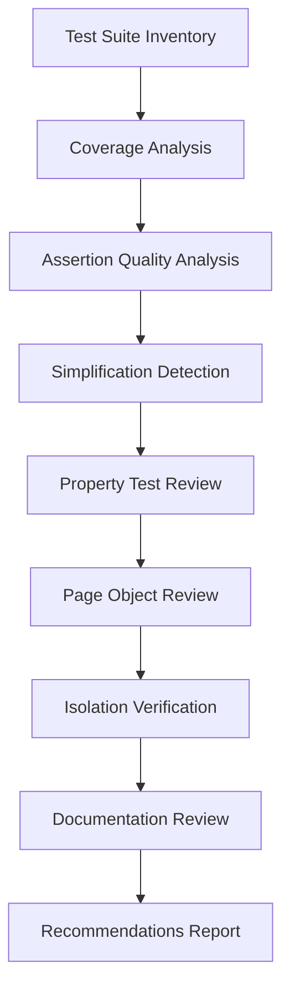

# Design Document: E2E Test Suite Review

## Overview

This design document outlines the approach for conducting a comprehensive review of the Zenith Bioscience E2E test suite. The review will systematically analyze test coverage, assertion quality, test isolation, and documentation to produce actionable recommendations for improvement.

The E2E test suite uses Playwright as the testing framework and follows the Page Object Model pattern. Tests are organized by feature area (auth, cart, checkout, account, admin, shop) with both standard tests and property-based tests for validating invariants.

## Architecture

The review process follows a structured analysis pipeline:



### Review Phases

1. **Inventory Phase**: Catalog all test files, test cases, and page objects
2. **Coverage Phase**: Map tests to core functionality and identify gaps
3. **Quality Phase**: Analyze assertion strength and test simplification
4. **Infrastructure Phase**: Review page objects, isolation, and documentation
5. **Synthesis Phase**: Generate prioritized recommendations

## Components and Interfaces

### Test Suite Structure

The current test suite is organized as follows:

```
e2e/
├── tests/
│   ├── account/          # Account management tests
│   ├── admin/            # Admin functionality tests
│   ├── auth/             # Authentication tests
│   ├── cart/             # Shopping cart tests
│   ├── checkout/         # Checkout flow tests
│   ├── reporting/        # Test infrastructure tests
│   ├── shop/             # Product catalog tests
│   └── smoke.spec.ts     # Basic smoke tests
├── page-objects/         # Page Object Model implementations
├── fixtures/             # Test data and fixtures
└── helpers/              # Utility functions
```

### Coverage Matrix Interface

```typescript
interface CoverageMatrix {
  featureArea: string;
  functionality: string;
  testFiles: string[];
  testCount: number;
  coverageStatus: 'full' | 'partial' | 'missing';
  gaps: string[];
}
```

### Assertion Analysis Interface

```typescript
interface AssertionAnalysis {
  testFile: string;
  testName: string;
  assertionType: 'existence' | 'content' | 'calculation' | 'state' | 'error';
  strength: 'strong' | 'weak' | 'trivial';
  issues: string[];
  recommendation: string;
}
```

### Simplification Detection Interface

```typescript
interface SimplificationReport {
  testFile: string;
  testName: string;
  simplificationType: 'skip' | 'silent-catch' | 'weak-assertion' | 'excessive-timeout' | 'partial-verification';
  originalIntent: string;
  currentBehavior: string;
  recommendation: string;
}
```

## Data Models

### Review Report Model

```typescript
interface E2EReviewReport {
  summary: {
    totalTests: number;
    totalPropertyTests: number;
    totalPageObjects: number;
    coverageScore: number;
    qualityScore: number;
  };
  coverageAnalysis: CoverageMatrix[];
  assertionAnalysis: AssertionAnalysis[];
  simplificationReport: SimplificationReport[];
  propertyTestReview: PropertyTestReview[];
  pageObjectReview: PageObjectReview[];
  isolationIssues: IsolationIssue[];
  documentationGaps: DocumentationGap[];
  recommendations: Recommendation[];
}
```

### Recommendation Model

```typescript
interface Recommendation {
  id: string;
  category: 'coverage' | 'assertion' | 'simplification' | 'property' | 'page-object' | 'isolation' | 'documentation';
  priority: 'critical' | 'high' | 'medium' | 'low';
  effort: 'small' | 'medium' | 'large';
  title: string;
  description: string;
  affectedFiles: string[];
  suggestedAction: string;
}
```

## Correctness Properties

*A property is a characteristic or behavior that should hold true across all valid executions of a system-essentially, a formal statement about what the system should do. Properties serve as the bridge between human-readable specifications and machine-verifiable correctness guarantees.*

### Property 1: Coverage Completeness

*For any* core functionality area defined in the requirements (authentication, cart, checkout, payments, account management, admin), the E2E test suite SHALL have at least one test file that exercises that functionality, and the review SHALL enumerate all test cases mapped to functionality areas.

**Validates: Requirements 1.1, 1.2, 1.3, 1.4, 1.5, 1.6, 1.7**

### Property 2: Assertion Non-Triviality

*For any* test assertion in the E2E test suite, the assertion SHALL verify specific expected values or states rather than merely checking for element existence. Specifically:
- Calculation assertions SHALL use exact values with tolerance (e.g., `toBeCloseTo`)
- State transition assertions SHALL verify both initial and final states
- User feedback assertions SHALL verify specific message content
- Regex patterns SHALL be specific enough to reject invalid data

**Validates: Requirements 2.1, 2.2, 2.3, 2.4, 2.5, 2.6**

### Property 3: Simplification Detection and Traceability

*For any* test in the E2E test suite, the review SHALL identify simplification patterns including:
- `test.skip()` usage that hides failing functionality
- Try-catch blocks that silently pass on exceptions
- Excessive timeouts (>10s) or retry loops that mask flaky behavior
- Conditional assertion skipping when data is difficult to parse

*For any* identified simplified test, the review SHALL document the original intent and recommend restoration.

**Validates: Requirements 3.1, 3.2, 3.4, 3.5**

### Property 4: Property Test Mathematical Validity

*For any* property test that verifies a calculation or invariant, the test SHALL:
- Assert the mathematical relationship holds (e.g., `total === sum(items)`)
- Handle parsing failures gracefully without silently passing
- Use dynamically calculated expected values rather than hardcoded constants
- Verify round-trip properties where applicable (e.g., add then remove returns to original state)

**Validates: Requirements 4.1, 4.2, 4.3, 4.4, 4.5**

### Property 5: Page Object Selector Reliability

*For any* page object file, the selectors SHALL:
- Use accessibility-based strategies (getByRole, getByLabel, getByText) as the primary approach
- Avoid fragile CSS selectors that depend on class names or DOM structure
- Include appropriate waits after actions that cause state changes
- Not duplicate selector logic that exists in other page objects

**Validates: Requirements 5.1, 5.2, 5.4, 5.5, 5.6**

### Property 6: Test Isolation Guarantee

*For any* test that modifies shared state (cart, user data, orders), the test SHALL:
- Clear cart state in beforeEach hooks
- Use isolated user accounts or run serially when sharing accounts
- Clean up created data in afterEach/afterAll hooks
- Not depend on test execution order for correct results

**Validates: Requirements 6.1, 6.2, 6.4, 6.5, 6.6**

### Property 7: Error Scenario Coverage

*For any* form or user interaction that can fail, the E2E test suite SHALL have tests that:
- Submit invalid input and verify error handling
- Verify specific error messages are displayed to users
- Test authentication failures (invalid credentials, expired sessions)
- Test payment failures for each payment method

**Validates: Requirements 7.1, 7.2, 7.3, 7.5, 7.6**

### Property 8: Mobile Viewport Handling

*For any* test that has different behavior on mobile vs desktop, the test SHALL:
- Handle both viewports appropriately (conditional logic or separate test cases)
- Use mobile-specific locators where UI differs between viewports
- Not fail on mobile when passing on desktop due to viewport-specific issues

**Validates: Requirements 8.1, 8.2, 8.3, 8.6**

### Property 9: Documentation Completeness

*For any* test file in the E2E test suite, the file SHALL:
- Have JSDoc comments on describe blocks explaining test purpose
- Reference specific requirements in comments (e.g., "Requirements: 5.1, 5.4")
- Document invariants being tested in property test files
- Document page structure and component relationships in page object files

**Validates: Requirements 9.1, 9.2, 9.4, 9.5**

### Property 10: Recommendation Actionability

*For any* generated recommendation in the review report, the recommendation SHALL include:
- Specific affected files
- Suggested actions with code examples where applicable
- Effort estimates (small, medium, large)
- Priority rating (critical, high, medium, low)
- Quick wins SHALL be identified separately for high-value, low-effort improvements

**Validates: Requirements 10.1, 10.2, 10.3, 10.4, 10.5, 10.6**

## Error Handling

### Analysis Errors

- **File Read Errors**: Log and continue with remaining files, note in report
- **Parse Errors**: Flag file as requiring manual review
- **Pattern Matching Failures**: Use conservative classification (flag for review)

### Report Generation Errors

- **Incomplete Data**: Generate partial report with clear indication of missing sections
- **Conflicting Classifications**: Flag for manual review with both classifications noted

## Testing Strategy

### Review Validation Approach

The review itself will be validated through:

1. **Manual Spot Checks**: Randomly sample 10% of classifications for manual verification
2. **Cross-Reference Validation**: Ensure all identified issues reference actual code
3. **Completeness Check**: Verify all test files are included in the analysis

### Property Test Validation

Property tests in the existing suite will be evaluated against:

1. **Invariant Correctness**: Does the property test actually verify the stated invariant?
2. **Edge Case Coverage**: Does the property test handle edge cases (empty cart, zero quantity)?
3. **Failure Behavior**: Does the property test fail appropriately when the invariant is violated?

### Unit Tests for Review Tools

If automated review tools are created:

- Test coverage matrix generation with known test suite structure
- Test assertion pattern detection with sample assertions
- Test simplification detection with known simplified tests
